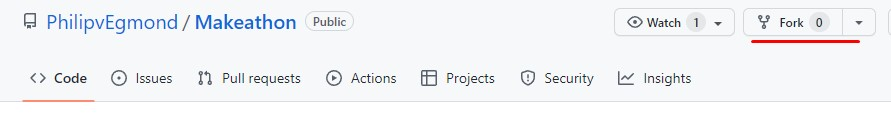
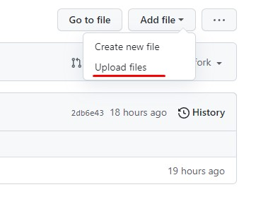
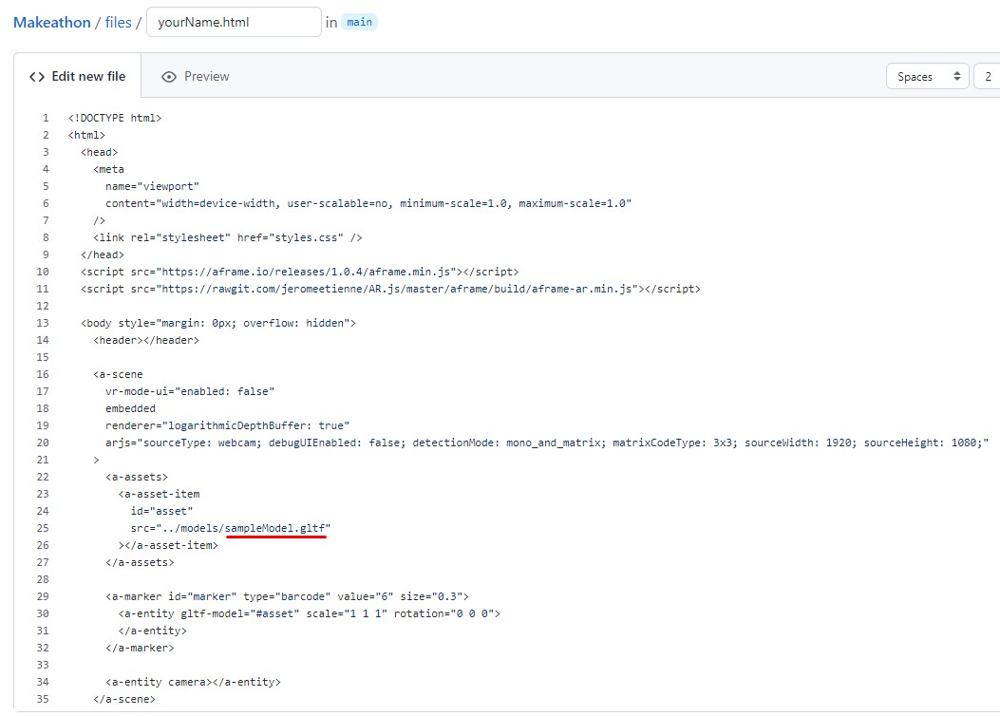
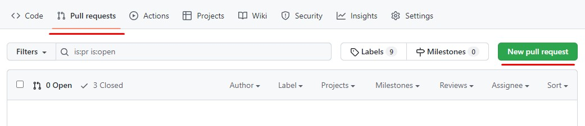

# View Your AR Model

This repository contains a platform for you to view your 3D models in AR on your phone without any coding required.
To upload, an account is required, so create one if you don't have one already.

## Your 3D Model

Make sure to export your 3D model to the .gltf fileformat and for clarity give it your own name so it's easy to keep track of.
Because web browsers work with limited memory make sure your model does not exceed 15MB at the very most; the smaller, the smoother the AR experience.

## Uploading Your Own Model

A few steps are required:

- Forking the project
- Upload 3D model
- Duplicate .html file
- Upload fork

### Forking the project

Press the fork button and then "Create fork", you should now see "YourUsername/Makeathon".
By forking the project you create your own copy to work in which later can be added to the main project.

### Upload 3D model

 
Click on the models folder, here you should find all other .gltf files already uploaded.
Click "Add file" > "Upload files".
Here you can drag and drop your 3D file, press "Commit changes" when you're done.
Navigate back to the models folder and you should see your model in there.

### Duplicate .html file

Now navigate to the files folder, here you should find all other .html files and my sampleFile.html.
Open sampleFile.html and copy its content, then back out of it.
Press "Add file" > "Create new file".
Give this file your own name as well and make sure to give it the .html format: yourName.html.
Paste the copied code into the empty file.
Replace "sampleModel.gltf" in the code with your own file you uploaded before, when you're done press "Commit new file".

### Upload fork

Now navigate to "Pull requests" and press the "New Pull request" button.
If you see a green checkmark with the text "Able to merge" you can press the "Create pull request" button.
Otherwise check what's conflicting, most likely the filename you used already exists, so change that and try again.
Give your merge a title, something like: "Merge request yourName" for example, then press "Create pull request".
Now I will have to accept the merge request before your changes are visible.

## Viewing Your Model

After I've accepted your merge request your model will be available on the following link after replacing yourName:
https://philipvegmond.github.io/Makeathon/files/yourName.html
This library requires a "Marker" to be tracked:

 
Aim your camera at this symbol and your 3D models will be placed on top of it.
